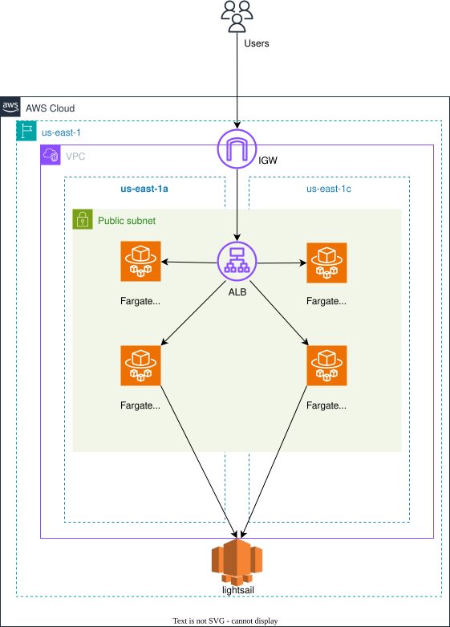

# Terraform for building my SNS application on AWS 
### 概要
[react_sns](https://github.com/ImuraEiki/react_sns)と[Go API](https://github.com/ImuraEiki/go_sns_api)のAWS環境(VPC / ECR / ECS / ALB等)を一括で構築します。
### 手順

#### terraformインストール
```
sh setup_terraform.sh
```

variables.tfのecr_image_versionはgitの最新コミットのハッシュを設定すること

#### リソース構築
```
terraform init
terraform plan
terraform apply -auto-approve
```

#### すべてを終了
```
terraform destroy -auto-approve
```

#### 構成図
